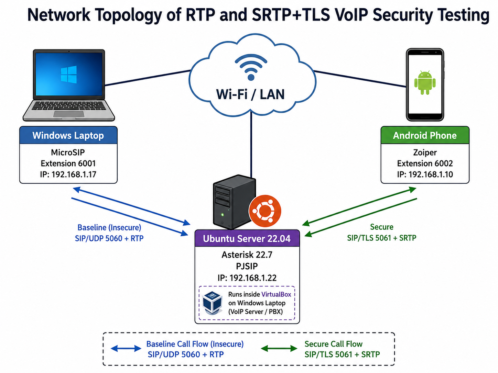
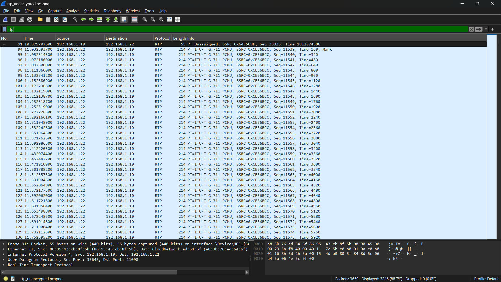
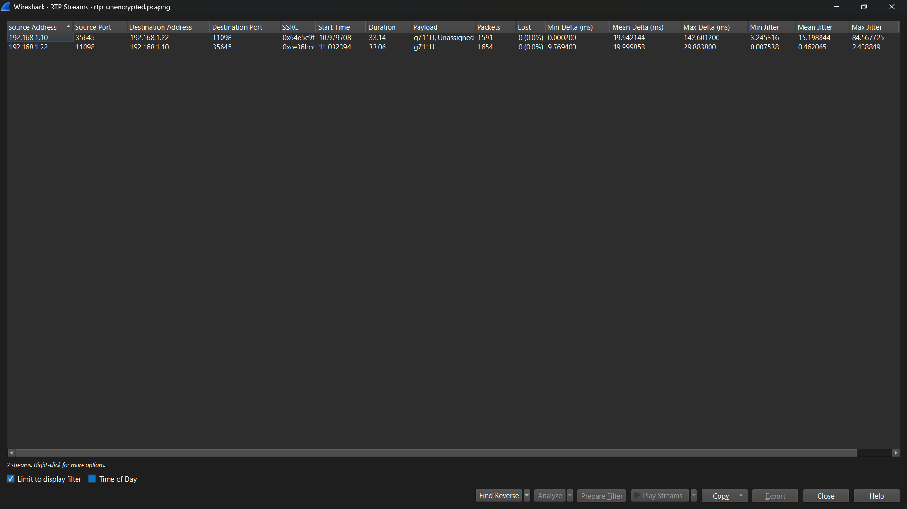
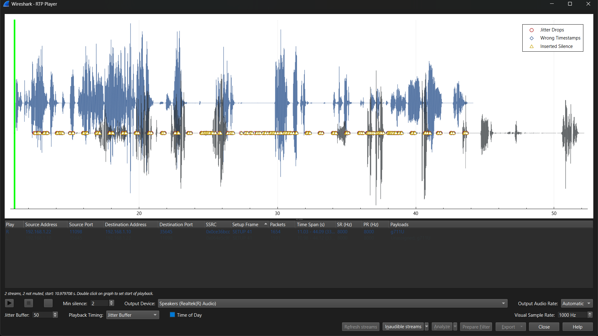
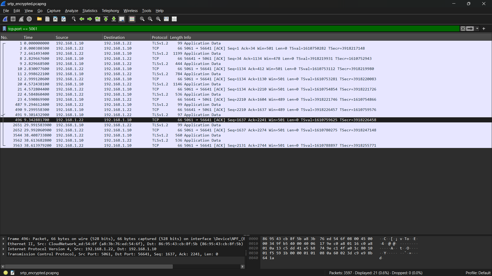
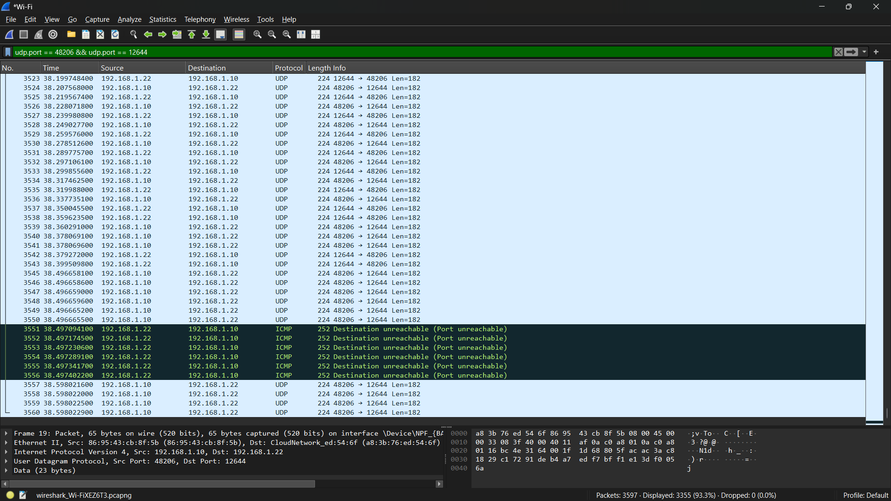
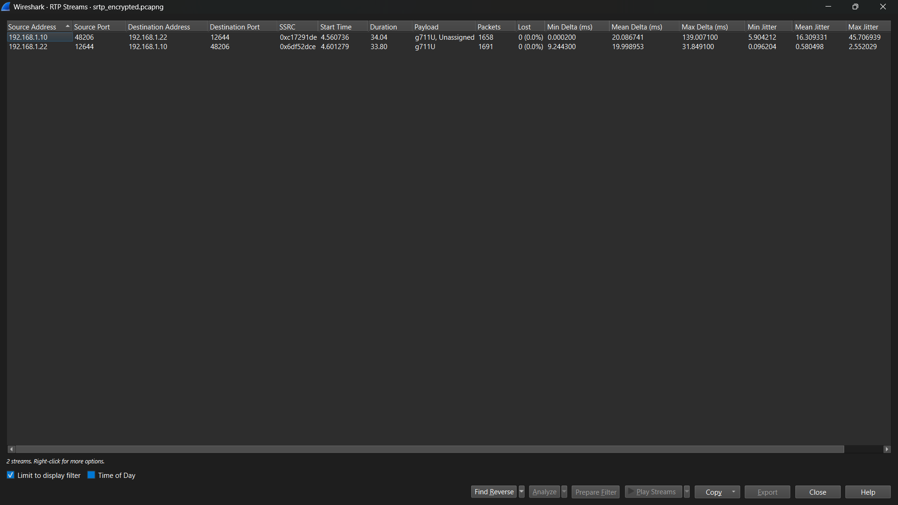
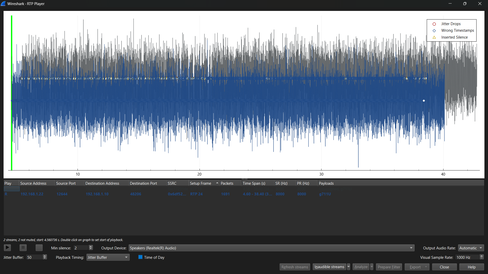

# SRTP VoIP Security Implementation

## Implementasi dan Analisis Keamanan VoIP Menggunakan SRTP dan TLS

Repository ini berisi implementasi dan hasil pengujian keamanan komunikasi **Voice over Internet Protocol (VoIP)** menggunakan **Real-Time Transport Protocol (RTP)** dan **Secure Real-Time Transport Protocol (SRTP)** yang dikombinasikan dengan **Transport Layer Security (TLS)**.

Proyek dilakukan sebagai **Proof of Concept (PoC)** untuk membandingkan komunikasi VoIP tanpa enkripsi dengan komunikasi yang telah menggunakan perlindungan kriptografi.

Server VoIP menggunakan **Asterisk 22.7.0 dengan PJSIP** pada Ubuntu Server 22.04 LTS. MicroSIP pada Windows digunakan sebagai endpoint ekstensi `6001`, sedangkan Zoiper pada Android digunakan sebagai endpoint ekstensi `6002`.

Wireshark digunakan untuk menangkap dan menganalisis trafik jaringan pada kedua skenario.

Hasil pengujian menunjukkan bahwa pada komunikasi RTP tanpa enkripsi, audio percakapan dapat direkonstruksi dan diputar kembali melalui Wireshark RTP Player. Setelah SRTP dan TLS diaktifkan, signaling terlindungi menggunakan TLS dan payload media hasil capture tidak dapat direkonstruksi menjadi percakapan yang dapat dipahami tanpa informasi kriptografi SRTP.

---

## Tujuan Pengujian

Tujuan proyek ini adalah:

1. Membangun server VoIP menggunakan Asterisk dan PJSIP.
2. Menghubungkan dua endpoint VoIP menggunakan MicroSIP dan Zoiper.
3. Menguji komunikasi VoIP menggunakan RTP tanpa enkripsi.
4. Membuktikan kemungkinan rekonstruksi audio RTP melalui packet capture.
5. Mengimplementasikan TLS untuk melindungi SIP signaling.
6. Mengimplementasikan SRTP-SDES untuk melindungi media suara.
7. Membandingkan hasil packet capture RTP dengan SRTP + TLS.
8. Menyediakan konfigurasi dan bukti pengujian agar eksperimen dapat direplikasi.

---

## Lingkungan Pengujian

Pengujian dilakukan pada jaringan lokal dengan server Asterisk yang dijalankan di dalam mesin virtual Ubuntu Server.

Seluruh perangkat terhubung pada jaringan Wi-Fi/LAN yang sama.

## Perangkat dan Software

| Komponen          | Spesifikasi / Software  | Fungsi                                          |
| ----------------- | ----------------------- | ----------------------------------------------- |
| Host Machine      | Windows                 | Menjalankan VirtualBox, MicroSIP, dan Wireshark |
| Virtualization    | Oracle VirtualBox       | Menjalankan Ubuntu Server                       |
| Server OS         | Ubuntu Server 22.04 LTS | Sistem operasi server VoIP                      |
| VoIP Server       | Asterisk 22.7.0         | PBX dan pengatur komunikasi                     |
| SIP Driver        | PJSIP                   | Endpoint, autentikasi, signaling, dan media     |
| Softphone 1       | MicroSIP                | Endpoint ekstensi 6001                          |
| Softphone 2       | Zoiper Android          | Endpoint ekstensi 6002                          |
| Packet Analyzer   | Wireshark               | Capture dan analisis trafik                     |
| Cryptography Tool | OpenSSL                 | Membuat certificate dan private key TLS         |

---

## Konfigurasi Jaringan

Alamat IP yang digunakan pada saat pengujian:

| Perangkat        | Fungsi           | Ekstensi | IP Address     |
| ---------------- | ---------------- | -------: | -------------- |
| Windows Laptop   | MicroSIP         |     6001 | `192.168.1.17` |
| Ubuntu Server VM | Asterisk / PJSIP |        - | `192.168.1.22` |
| Android Phone    | Zoiper           |     6002 | `192.168.1.10` |

Ubuntu Server dijalankan melalui VirtualBox menggunakan:

```text
Network Mode: Bridged Adapter
```

Mode tersebut memungkinkan VM mendapatkan IP pada subnet yang sama dengan Windows dan Android.

---

## Topologi Jaringan



Secara sederhana, alur komunikasi adalah:

```text
MicroSIP
Extension 6001
192.168.1.17
      |
      |
      v
Asterisk 22.7.0
Ubuntu Server
192.168.1.22
      |
      |
      v
Zoiper
Extension 6002
192.168.1.10
```

Asterisk bertindak sebagai PBX yang menerima registrasi kedua endpoint dan mengatur panggilan antara ekstensi `6001` dan `6002`.

---

## Skenario Pengujian

Terdapat dua skenario utama.

## Skenario 1: RTP Tanpa Enkripsi

Konfigurasi:

```text
SIP Signaling : UDP
SIP Port      : 5060
Media         : RTP
Encryption    : Disabled
```

Alur:

```text
MicroSIP 6001
     |
     | SIP / UDP 5060
     | RTP
     v
Asterisk
     |
     | SIP / UDP 5060
     | RTP
     v
Zoiper 6002
```

Tujuan skenario ini adalah membuktikan bahwa media RTP yang tidak dienkripsi dapat dianalisis dan direkonstruksi oleh pihak yang memperoleh packet capture.

---

## Skenario 2: SRTP + TLS

Konfigurasi:

```text
SIP Signaling : TLS
SIP Port      : 5061
Media         : SRTP
Key Mechanism : SDES
```

Alur:

```text
MicroSIP 6001
     |
     | SIP / TLS 5061
     | SRTP
     v
Asterisk
     |
     | SIP / TLS 5061
     | SRTP
     v
Zoiper 6002
```

Asterisk menggunakan parameter:

```ini
transport=transport-tls
media_encryption=sdes
```

TLS digunakan untuk melindungi SIP signaling, sedangkan SRTP digunakan untuk melindungi payload media suara.

---

## Struktur Repository

```text
SRTP-VoIP-Security-Implementation/
│
├── .gitignore
├── README.md
│
├── captures/
│   ├── rtp_unencrypted.pcapng
│   └── srtp_encrypted.pcapng
│
├── configs/
│   ├── extensions.conf
│   ├── extensions_combined_demo.conf
│   ├── pjsip.conf
│   ├── pjsip_combined_demo.conf
│   └── pjsip_rtp.conf
│
├── docs/
│   ├── Final_Report_Group.pdf
│   ├── Network_Topology.png
│   └── evidence/
│       ├── rtp/
│       │   ├── 01_rtp_packets.png
│       │   ├── 02_rtp_streams.png
│       │   └── 03_rtp_player.png
│       └── srtp_tls/
│           ├── 01_tls_5061.png
│           ├── 02_srtp_udp_media.png
│           ├── 03_srtp_streams.png
│           └── 04_srtp_noise_playback.png
│
└── scripts/
    └── setup_certificates.sh
```

---

## Konfigurasi Asterisk

### Konfigurasi RTP Baseline

File:

```text
configs/pjsip_rtp.conf
```

digunakan untuk skenario RTP tanpa enkripsi.

Endpoint menggunakan:

```ini
transport=transport-udp
```

dan tidak menggunakan:

```ini
media_encryption=sdes
```

Transport UDP:

```ini
[transport-udp]
type=transport
protocol=udp
bind=0.0.0.0:5060
```

---

### Konfigurasi SRTP + TLS

File:

```text
configs/pjsip.conf
```

digunakan untuk skenario komunikasi aman.

Transport TLS:

```ini
[transport-tls]
type=transport
protocol=tls
bind=0.0.0.0:5061
cert_file=/etc/asterisk/keys/asterisk.crt
priv_key_file=/etc/asterisk/keys/asterisk.key
method=tlsv1_2
```

Endpoint menggunakan:

```ini
transport=transport-tls
media_encryption=sdes
direct_media=no
```

---

### Optional Combined Demo Configuration

Untuk mempermudah demonstrasi tanpa mengganti file konfigurasi dan
me-restart Asterisk ketika berpindah skenario, repository menyediakan
konfigurasi tambahan:

- `configs/pjsip_combined_demo.conf`
- `configs/extensions_combined_demo.conf`

Konfigurasi tersebut menggunakan:

| Scenario     | MicroSIP | Zoiper | Signaling    | Media     |
| ------------ | -------: | -----: | ------------ | --------- |
| RTP Baseline |     6001 |   6002 | SIP/UDP 5060 | RTP       |
| Secure       |     7001 |   7002 | SIP/TLS 5061 | SRTP-SDES |

Konfigurasi combined digunakan untuk mempermudah demonstrasi.
Capture dan evidence eksperimen utama menggunakan endpoint 6001 dan
6002 pada kedua skenario.

---

### Konfigurasi Ekstensi

Dua ekstensi digunakan:

```text
6001 → MicroSIP
6002 → Zoiper
```

Dialplan pada:

```text
configs/extensions.conf
```

adalah:

```ini
[from-internal]

exten => 6001,1,Dial(PJSIP/6001,30)
 same => n,Hangup()

exten => 6002,1,Dial(PJSIP/6002,30)
 same => n,Hangup()
```

---

## Credential Repository

Password asli yang digunakan selama pengujian lokal tidak disimpan pada repository publik.

File konfigurasi menggunakan placeholder:

```text
CHANGE_ME_6001
CHANGE_ME_6002
CHANGE_ME_7001
CHANGE_ME_7002
```

Sebelum melakukan pengujian, ganti placeholder tersebut dengan password lokal.

Contoh:

```ini
[auth6001]
type=auth
auth_type=userpass
username=6001
password=YOUR_PASSWORD_6001
```

---

## Pembuatan Sertifikat TLS

Script tersedia pada:

```text
scripts/setup_certificates.sh
```

Script tersebut membuat:

```text
/etc/asterisk/keys/asterisk.crt
/etc/asterisk/keys/asterisk.key
```

Certificate yang digunakan merupakan **self-signed certificate** untuk kebutuhan Proof of Concept pada lingkungan lokal.

Berikan executable permission:

```bash
chmod +x scripts/setup_certificates.sh
```

Kemudian jalankan:

```bash
sudo ./scripts/setup_certificates.sh
```

---

## Cara Replikasi

## 1. Siapkan Server

Gunakan:

```text
Ubuntu Server 22.04 LTS
Asterisk 22.7.0
PJSIP
```

Pastikan client dapat menjangkau server.

Contoh:

```powershell
ping 192.168.1.22
```

---

## 2. Skenario RTP

Salin konfigurasi baseline:

```bash
sudo cp configs/pjsip_rtp.conf /etc/asterisk/pjsip.conf
sudo cp configs/extensions.conf /etc/asterisk/extensions.conf
```

Ganti:

```text
CHANGE_ME_6001
CHANGE_ME_6002
```

dengan password lokal.

Restart Asterisk:

```bash
sudo systemctl restart asterisk
```

Masuk ke CLI:

```bash
sudo asterisk -rvvv
```

Periksa endpoint:

```text
pjsip show endpoints
```

---

## 3. Konfigurasi MicroSIP untuk RTP

Gunakan:

```text
SIP Server       : IP Asterisk
Username         : 6001
Login            : 6001
Password         : password lokal
Transport        : UDP
Media Encryption : Disabled
```

---

## 4. Konfigurasi Zoiper untuk RTP

Gunakan:

```text
Host / Domain : IP Asterisk
Username      : 6002
Password      : password lokal
Transport     : UDP
SRTP          : Disabled
```

Pastikan kedua endpoint berstatus registered.

---

## Capture RTP

Buka Wireshark dan pilih interface jaringan yang digunakan.

Pada pengujian ini:

```text
Wi-Fi
```

Mulai capture kemudian lakukan panggilan:

```text
6001 → 6002
```

Setelah beberapa detik, tutup panggilan dan hentikan capture.

Gunakan filter:

```text
rtp
```

Kemudian:

```text
Telephony
→ RTP
→ RTP Streams
→ Play Streams
```

Pada pengujian ini, audio percakapan dapat diputar kembali dengan jelas.

Capture disimpan sebagai:

```text
captures/rtp_unencrypted.pcapng
```

---

## Bukti RTP

### Paket RTP



### RTP Streams



### RTP Player



Hasil playback menunjukkan isi percakapan dapat direkonstruksi dari packet capture.

---

## Pengujian SRTP + TLS

Setelah pengujian baseline selesai, buat certificate TLS:

```bash
sudo ./scripts/setup_certificates.sh
```

Kemudian gunakan konfigurasi:

```bash
sudo cp configs/pjsip.conf /etc/asterisk/pjsip.conf
sudo cp configs/extensions.conf /etc/asterisk/extensions.conf
```

Restart Asterisk:

```bash
sudo systemctl restart asterisk
```

---

## Konfigurasi MicroSIP untuk SRTP + TLS

Gunakan:

```text
SIP Server       : IP_ASTERISK:5061
Username         : 6001
Login            : 6001
Transport        : TLS
Media Encryption : Mandatory SRTP
```

---

## Konfigurasi Zoiper untuk SRTP + TLS

Gunakan:

```text
Host / Domain : IP_ASTERISK:5061
Username      : 6002
Transport     : TLS
Enable SRTP   : Enabled
```

Pastikan akun kembali berstatus:

```text
Registered
```

---

## Verifikasi Asterisk

Periksa endpoint:

```text
pjsip show endpoint 6001
```

dan:

```text
pjsip show endpoint 6002
```

Konfigurasi yang diharapkan:

```text
Transport        : transport-tls
Media Encryption : sdes
```

Periksa transport:

```text
pjsip show transports
```

Hasil pada pengujian:

```text
transport-tls    tls    0.0.0.0:5061
transport-udp    udp    0.0.0.0:5060
```

---

## Capture SRTP + TLS

Mulai capture Wireshark kemudian lakukan kembali panggilan:

```text
6001 → 6002
```

Panggilan tetap dapat dilakukan dan audio tetap terdengar normal pada kedua endpoint.

Setelah selesai, hentikan capture.

Capture disimpan sebagai:

```text
captures/srtp_encrypted.pcapng
```

---

## Analisis TLS

Gunakan filter:

```text
tcp.port == 5061
```

atau:

```text
tls
```

Wireshark berhasil mendeteksi trafik TLS pada port 5061.



---

## Analisis Media SRTP

Pada pengujian SRTP + TLS, filter:

```text
rtp
```

tidak langsung menampilkan stream media.

Trafik media dapat ditemukan melalui:

```text
Statistics
→ Conversations
→ UDP
```

Pada capture pengujian ditemukan conversation utama:

```text
192.168.1.10:48206
        ↕
192.168.1.22:12644
```

Conversation tersebut memiliki lebih dari 3.000 paket dengan durasi sekitar 34 detik dan trafik dua arah yang relatif seimbang.

Nomor port tersebut bersifat dinamis dan dapat berbeda pada setiap panggilan.



---

## Decode As RTP

Untuk menganalisis struktur stream, trafik UDP dipaksa menggunakan:

```text
Decode As
→ RTP
```

Setelah proses tersebut, Wireshark dapat menampilkan dua arah stream pada RTP Streams.



Perlu diperhatikan bahwa **Decode As RTP bukan proses dekripsi SRTP**.

Fitur tersebut hanya memaksa Wireshark memperlakukan paket sebagai struktur RTP.

---

## Playback SRTP

Ketika stream tersebut diputar menggunakan RTP Player, audio yang dihasilkan hanya berupa noise atau suara acak.

Isi percakapan tidak dapat dipahami.



Hal tersebut berbeda dengan skenario RTP tanpa enkripsi, di mana audio dapat diputar kembali dengan jelas.

---

## Hasil Pengujian

| Parameter               | RTP Tanpa Enkripsi | SRTP + TLS                    |
| ----------------------- | ------------------ | ----------------------------- |
| Endpoint                | 6001 ↔ 6002        | 6001 ↔ 6002                   |
| Status Panggilan        | Berhasil           | Berhasil                      |
| SIP Transport           | UDP                | TLS                           |
| Port Signaling          | 5060               | 5061                          |
| Media                   | RTP                | SRTP                          |
| Media Encryption        | Tidak              | Ya                            |
| Mekanisme SRTP          | -                  | SDES                          |
| TLS                     | Tidak              | Ya                            |
| Deteksi RTP Otomatis    | Berhasil           | Tidak langsung                |
| Packet Capture          | Berhasil           | Berhasil                      |
| Audio Playback          | Jelas              | Noise / acak                  |
| Rekonstruksi Percakapan | Berhasil           | Tidak berhasil tanpa key SRTP |
| Risiko Eavesdropping    | Tinggi             | Lebih terlindungi             |

---

## Analisis Hasil

Pada kedua skenario, panggilan antara ekstensi 6001 dan 6002 dapat dilakukan dengan normal. Hal ini menunjukkan bahwa penggunaan enkripsi tidak menghalangi fungsi dasar komunikasi VoIP pada lingkungan pengujian.

Perbedaan utama terlihat ketika trafik jaringan dianalisis.

Pada RTP tanpa enkripsi, Wireshark dapat mengenali paket RTP secara langsung dan merekonstruksi payload audio menggunakan RTP Player. Percakapan yang dilakukan selama pengujian dapat terdengar dengan jelas dari hasil packet capture.

Kondisi tersebut menunjukkan bahwa RTP tidak memberikan kerahasiaan terhadap payload media.

Pada skenario SRTP + TLS, packet capture tetap dapat dilakukan. Enkripsi bukan mekanisme untuk menyembunyikan keberadaan paket jaringan.

Namun, signaling SIP terlindungi menggunakan TLS dan payload media dilindungi menggunakan SRTP.

Ketika stream SRTP dianalisis sebagai RTP dan diputar melalui RTP Player, hasil audio hanya berupa noise atau suara acak. Isi percakapan tidak dapat direkonstruksi menjadi informasi yang dapat dipahami tanpa informasi kriptografi yang diperlukan.

Dengan demikian, perbedaan utama kedua skenario adalah kemampuan pihak yang memperoleh packet capture untuk memperoleh informasi bermakna dari trafik tersebut.

---

## Ringkasan Alur Pengujian

## RTP

```text
MicroSIP 6001
      ↓
SIP / UDP 5060
      ↓
Asterisk
      ↓
RTP
      ↓
Zoiper 6002
      ↓
Wireshark Capture
      ↓
RTP Streams
      ↓
Playback
      ↓
Audio Jelas
```

## SRTP + TLS

```text
MicroSIP 6001
      ↓
SIP / TLS 5061
      ↓
Asterisk
      ↓
SRTP
      ↓
Zoiper 6002
      ↓
Wireshark Capture
      ↓
Encrypted Media
      ↓
Decode As RTP
      ↓
Playback
      ↓
Noise / Audio Tidak Dapat Dipahami
```

---

## Artefak Utama

| Artefak                                 | Fungsi                                             |
| --------------------------------------- | -------------------------------------------------- |
| `captures/rtp_unencrypted.pcapng`       | Bukti trafik RTP tanpa enkripsi                    |
| `captures/srtp_encrypted.pcapng`        | Bukti trafik SRTP + TLS                            |
| `configs/pjsip_rtp.conf`                | Konfigurasi baseline SIP/UDP + RTP                 |
| `configs/pjsip.conf`                    | Konfigurasi SIP/TLS + SRTP-SDES                    |
| `configs/extensions.conf`               | Dialplan 6001 dan 6002                             |
| `docs/Network_Topology.png`             | Topologi jaringan                                  |
| `docs/evidence/rtp/`                    | Screenshot pengujian RTP                           |
| `docs/evidence/srtp_tls/`               | Screenshot pengujian SRTP + TLS                    |
| `scripts/setup_certificates.sh`         | Script pembuatan certificate TLS                   |
| `configs/pjsip_combined_demo.conf`      | Konfigurasi gabungan untuk demo RTP dan SRTP + TLS |
| `configs/extensions_combined_demo.conf` | Dialplan 6001/6002 dan 7001/7002 untuk demo        |
| `docs/Final_Report_Group.pdf`           | Laporan akademik final                             |

---

## Kesimpulan

Berdasarkan pengujian yang dilakukan, komunikasi VoIP menggunakan RTP tanpa enkripsi memiliki risiko terhadap serangan eavesdropping apabila pihak lain berhasil memperoleh trafik jaringan.

Wireshark dapat mendeteksi stream RTP dan merekonstruksi payload audio sehingga isi percakapan dapat diputar kembali.

Implementasi SRTP-SDES pada media dan TLS pada signaling meningkatkan perlindungan komunikasi. Meskipun paket jaringan tetap dapat ditangkap, payload media hasil capture tidak dapat direkonstruksi menjadi percakapan yang dapat dipahami tanpa informasi kriptografi SRTP.

Hasil tersebut menunjukkan pentingnya penerapan perlindungan terhadap media dan signaling secara bersamaan pada implementasi VoIP.

---

## Batasan Pengujian

Pengujian ini dilakukan sebagai Proof of Concept pada jaringan lokal.

Beberapa batasan proyek:

- menggunakan self-signed certificate;
- dilakukan pada jaringan LAN/Wi-Fi lokal;
- menggunakan dua endpoint;
- belum melakukan pengukuran statistik QoS seperti jitter, delay, packet loss, dan CPU overhead secara berulang;
- belum menguji serangan aktif seperti Man-in-the-Middle secara khusus;
- menggunakan SDES sebagai mekanisme pertukaran parameter SRTP;
- belum membandingkan SRTP dengan DTLS-SRTP atau ZRTP.

Karena itu, hasil pengujian tidak dimaksudkan sebagai evaluasi keamanan lengkap untuk deployment VoIP produksi.

---

## Catatan Keamanan

Repository ini dibuat untuk tujuan akademik dan pengujian keamanan pada lingkungan yang dikendalikan.

Jangan melakukan packet capture atau penyadapan terhadap komunikasi yang tidak memiliki izin.

Credential asli tidak disimpan di repository.

Sebelum menggunakan konfigurasi:

```text
CHANGE_ME_6001
CHANGE_ME_6002
CHANGE_ME_7001
CHANGE_ME_7002
```

harus diganti dengan credential lokal yang aman.

Untuk deployment produksi, self-signed certificate sebaiknya diganti dengan certificate yang diterbitkan oleh Certificate Authority yang terpercaya.

---

## Laporan Akhir

Laporan akademik lengkap proyek tersedia pada:

[Final Report](docs/Final_Report_Group.pdf)

Laporan tersebut memuat metodologi, konfigurasi, hasil pengujian,
analisis perbandingan RTP dan SRTP + TLS, serta kesimpulan proyek.

## Referensi

- Baugher, M., McGrew, D., Naslund, M., Carrara, E., & Norrman, K. (2004). _The Secure Real-time Transport Protocol (SRTP)_. RFC 3711. Internet Engineering Task Force.
- Rosenberg, J., Schulzrinne, H., Camarillo, G., Johnston, A., Peterson, J., Sparks, R., Handley, M., & Schooler, E. (2002). _SIP: Session Initiation Protocol_. RFC 3261. Internet Engineering Task Force.
- Asterisk Project Documentation. _PJSIP, TLS, and Secure Calling Documentation_.
- Wireshark Documentation. _RTP Analysis and RTP Player_.
- Stallings, W. (2017). _Cryptography and Network Security: Principles and Practice_ (7th ed.). Pearson.

---
